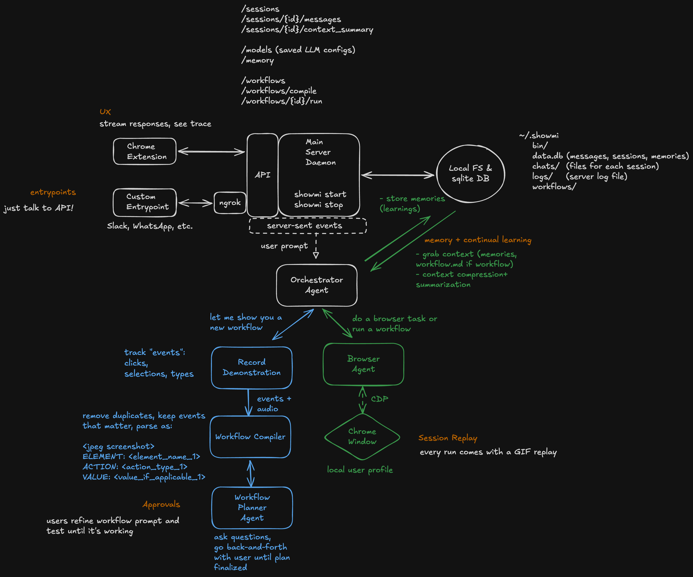

<div align="center">
  

  <h1>Showmi</h1>

  <p><strong>Show, don't prompt.</strong></p>

  <p>
    A self-learning browser agent that lives in your Chrome side panel.<br />
    Show it a workflow once — run it forever.
  </p>

  <p>
    <a href="https://www.python.org/downloads/"></a>
    <a href="https://developer.chrome.com/docs/extensions/mv3/intro/"></a>
    <a href="https://github.com/browser-use/browser-use"></a>
  </p>
</div>

---

## What it is

Showmi is a local browser agent. It runs entirely on your machine, drives **your real Chrome** with **your real logins**, and lives in its own tab group so it can never touch the rest of your browser.

- **Sidebar-native.** Every interaction happens in the Chrome side panel — no separate window, no headless browser.
- **Learns by demonstration.** Hit record, do the workflow once, and Showmi turns it into a reusable script.
- **Stays in its lane.** The agent operates only inside the Showmi tab group. Your other tabs are invisible to it.

## Quickstart

### Prerequisites

- **Python 3.11+** — [python.org](https://www.python.org/downloads/)
- **Git** — [git-scm.com](https://git-scm.com/)
- **Google Chrome**
- **uv** *(optional, faster install)* — [docs.astral.sh/uv](https://docs.astral.sh/uv/)

### 1. Install

```bash
curl -fsSL https://raw.githubusercontent.com/AniruddhS24/showmi/main/install.sh | sh
```

### 2. Configure a model

```bash
showmi models add
```

You can also do this later from the side panel — any OpenAI-compatible endpoint works.

### 3. Load the Chrome extension

1. Open `chrome://extensions`
2. Enable **Developer mode** (top-right)
3. Click **Load unpacked**
4. Select `~/.showmi/repo/extension/`

> macOS: hit `Cmd+Shift+.` in Finder to see hidden folders.

### 4. Start the server

```bash
showmi start
```

Pin the Showmi action in Chrome, click it to open the side panel, and start chatting.

## Commands

```bash
showmi start          # start the server (background)
showmi stop           # stop the server
showmi restart        # restart the server
showmi serve          # start in foreground (dev mode)
showmi status         # see server status and config
showmi models list    # list configured models
showmi sessions       # list recent chat sessions
showmi logs           # tail server logs
showmi upgrade        # pull latest code and restart
showmi uninstall      # delete all data and uninstall
```

`showmi status`, `showmi restart`, and `showmi logs` are usually enough to debug anything.

## How it works

```
Chrome Sidebar  ──HTTP/SSE──>  FastAPI Server  ──>  Orchestrator  ──>  Browser Agent
                                                        │
                                                        ├──>  Planning Agent
                                                        └──>  Memory / Workflows
```

A FastAPI daemon on `localhost:8765` runs the agent (built on [browser-use](https://github.com/browser-use/browser-use)) and a CDP reverse proxy. The Chrome extension uses the `chrome.debugger` API against tabs in the Showmi tab group and bridges commands to the proxy — no `--remote-debugging-port`, no separate Chrome window.

<div align="center">
  
</div>

See [`docs/architecture.md`](docs/architecture.md) for the full picture.

## Project layout

```
showmi/
├── src/showmi/      # Python backend (FastAPI server, agent, CDP proxy)
├── extension/       # Chrome MV3 side panel extension
├── docs/            # Architecture notes and diagrams
├── install.sh       # One-line installer
└── Makefile         # Dev shortcuts
```

---

<div align="center">
  <sub>Built on <a href="https://github.com/browser-use/browser-use">browser-use</a>.</sub>
</div>
